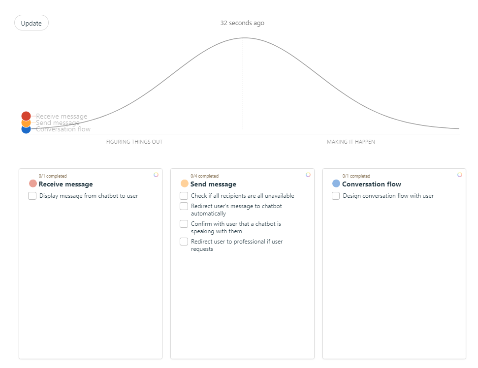
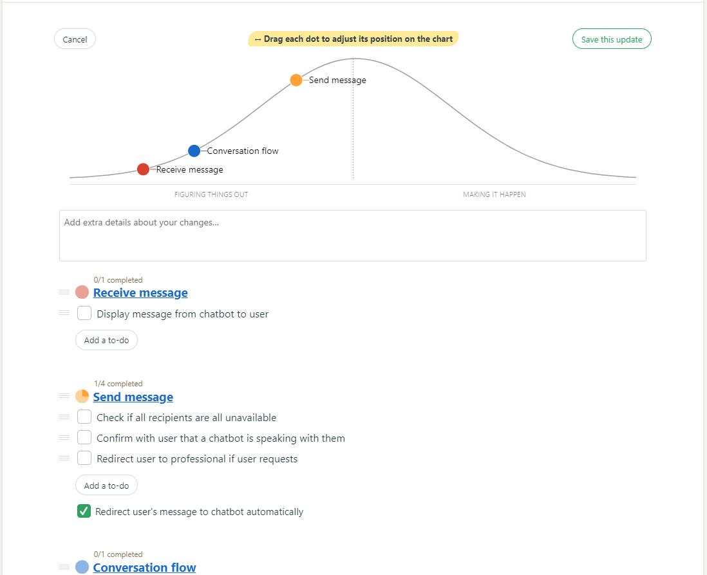
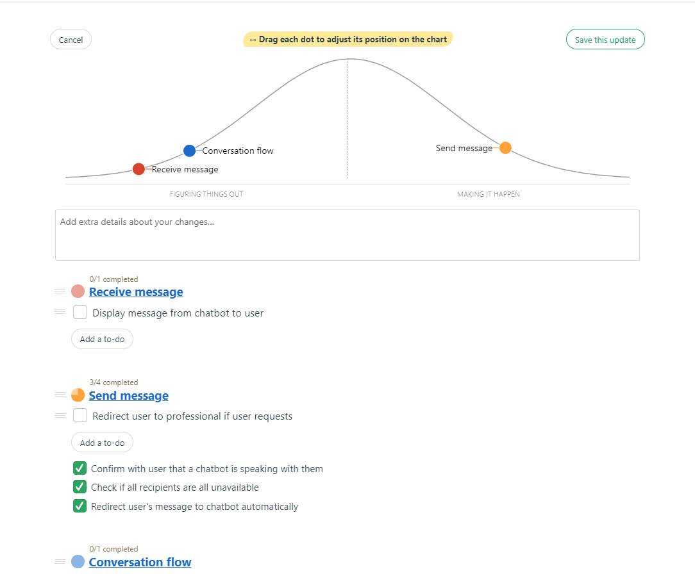

# Chatbot
## Scopes
* Conversation flow
* **Send message**
* Receive message

### Conversation flow
* Design conversation flow with user

### **Send message (focus)**
* Check if all recipients are all unavailable
* Redirect user's message to chatbot automatically
* Confirm with user that a chatbot is speaking with them
* Redirect user to professional if user requests

### Receive message
* Display message from chatbot to user

## Hill charts

### Original

### One Task Done

### Three Tasks done
